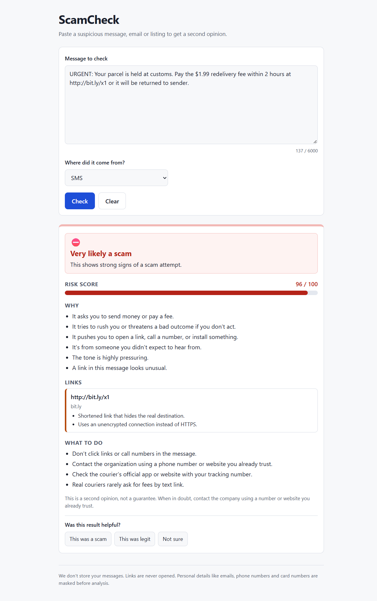
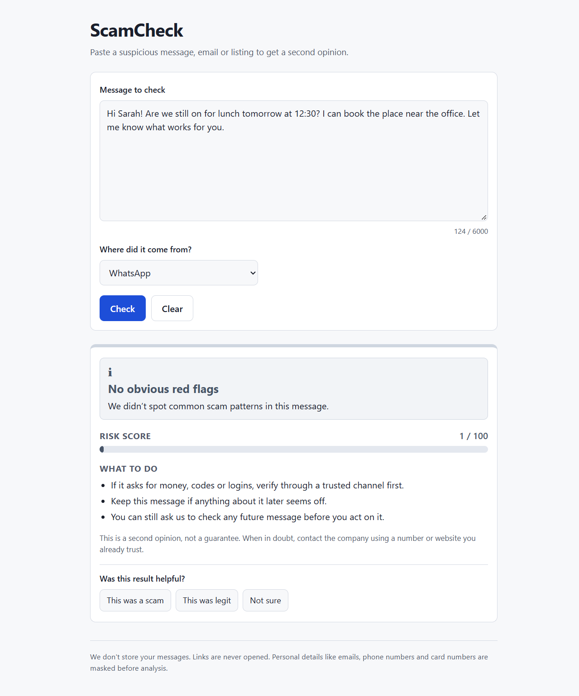
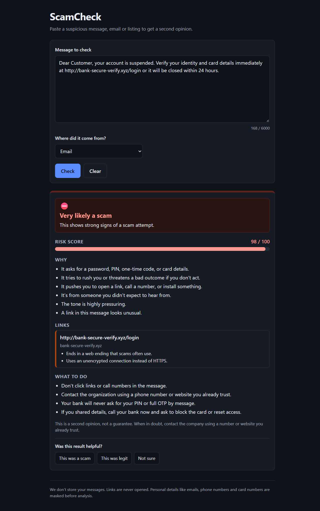
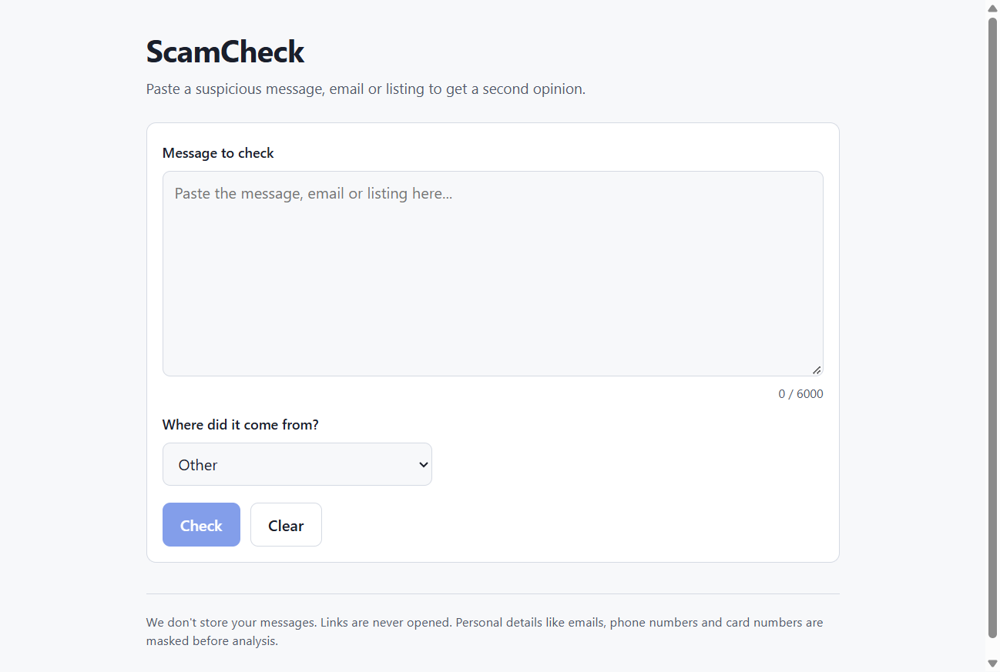

# ScamCheck

**Paste a suspicious SMS, email, DM or listing. Get a scam verdict, a risk score, plain-English reasons, and what to do next.**

ScamCheck is a small web app + HTTP API (and a Manifest V3 browser extension) powered by [Jev](https://typesafe.ai) — TypeSafe AI's "System One" model. Jev returns *typed, calibrated decisions*, not text. All of the wording you see is generated from our own templates, and deterministic code checks (URL analysis, PII masking) run alongside the model.



## Why it's built this way

- **One model call per check.** Jev answers ~11 questions (yes/no, a choice, a score) in a single request — usually a few hundred milliseconds.
- **The model never writes.** Reasons, advice and link warnings come from `src/core/templates.ts`, keyed by Jev's answers.
- **Code can only *raise* risk, never lower it.** URL findings and signal floors are applied on top of Jev's `is_scam` probability.
- **Privacy by default.** Messages are never logged or stored; links are never opened; emails, phones and card numbers are masked before analysis; the API key never leaves the server.

## Features

- Verdict bands: `very_likely_scam`, `likely_scam`, `suspicious`, `no_obvious_red_flags` (never claims a message is "safe")
- 0–100 risk score with an accessible meter
- 2–5 plain-language reasons and per-link findings (shorteners, lookalike brands, IP hosts, risky TLDs, punycode, and more)
- Scam-type-specific advice (13 scam types), a confidence note, and a permanent disclaimer
- Degraded mode: if Jev is unreachable, returns a URL-only result marked `degraded: true` — never a green verdict
- In-memory per-IP daily rate limit, CORS allow-list, 50 KB body cap
- Feedback endpoint (`scam` / `not_scam` / `unsure`) logged without message text
- Mobile-first, dark-mode-aware, keyboard-accessible UI with no frameworks and no bundler
- Browser extension: right-click selected text → "Check if this is a scam"

## Screenshots

| Scam detected | No obvious red flags |
|---|---|
|  |  |

| Dark mode | Landing |
|---|---|
|  |  |

## How it works

```
text ──▶ normalize/truncate ──▶ extract+analyze URLs (pure code)
     ──▶ redact PII ──▶ ONE Jev call ──▶ combine (code can only raise risk)
     ──▶ render reasons/advice from templates ──▶ CheckResult
```

1. **Sanitize** — Unicode NFKC, whitespace normalization, truncate, then mask emails/phones/card numbers.
2. **URL analysis** — string-only (no DNS, no HTTP): `tldts` for the registrable domain, brand/keyword and TLD checks.
3. **Jev** — one `systemOne` call with a typed question set (`noul`, `choice`, `score`).
4. **Verdict** — floors for signal count, credentials+impersonation, and URL risk; band + confidence + reason codes.
5. **Templates** — all human-readable text.

## Quickstart

Requires **Node.js 20+** and a TypeSafe API key.

```sh
npm install
cp .env.example .env      # Windows: copy .env.example .env
# put your key in .env:  TYPESAFE_API_KEY=...
npm run dev               # http://localhost:8787
```

Then:

```sh
curl -s localhost:8787/api/check -H 'content-type: application/json' \
  -d '{"text":"Your package is held. Pay $1.99 at http://bit.ly/x1 now","channel":"sms"}'
```

### Environment variables

| Variable | Default | Purpose |
|---|---|---|
| `TYPESAFE_API_KEY` | _(empty)_ | Server-side Jev key. If missing, the server still starts but `/api/check` returns 503. |
| `JEV_MODEL` | `jev-latest` | Model alias sent to Jev. |
| `PORT` | `8787` | HTTP port. |
| `MAX_INPUT_CHARS` | `6000` | Text is truncated to this length before analysis. |
| `FREE_DAILY_LIMIT` | `10` | Checks per IP per UTC day. |
| `ALLOWED_ORIGINS` | `http://localhost:8787` | Comma-separated CORS allow-list (`chrome-extension://` is always allowed). |
| `FEEDBACK_FILE` | `data/feedback.jsonl` | JSONL feedback log (no message text). |

## API

`POST /api/check` — body `{ "text": string, "channel"?: "sms"|"email"|"whatsapp"|"social"|"marketplace"|"other" }`

```jsonc
{
  "requestId": "uuid",
  "verdict": "likely_scam",
  "riskScore": 78,
  "scamType": "delivery_fee",
  "confidence": "high",
  "reasons": [{ "code": "ASKS_PAYMENT", "text": "It asks you to send money or pay a fee." }],
  "links": [{ "url": "http://bit.ly/x1", "host": "bit.ly", "risk": "medium",
              "flags": [{ "code": "SHORTENER", "text": "Shortened link that hides the real destination." }] }],
  "advice": ["Don't click links or call numbers in the message."],
  "degraded": false,
  "truncated": false,
  "modelVersion": "jev-1.13.0"
}
```

- `POST /api/feedback` — `{ requestId, label: "scam"|"not_scam"|"unsure" }` → `204`
- `GET /api/health` → `{ "ok": true }`

Errors: `400` validation · `413` body > 50 KB · `429` daily limit · `503` key missing / checker unavailable.

## Testing & evaluation

```sh
npm run typecheck   # tsc --noEmit
npm test            # vitest — 100 tests, no network (uses FakeJudge)
npm run smoke       # one real Jev call, prints the raw response
npm run eval        # real-Jev accuracy report over 36 fixtures
```

All tests run offline against `FakeJudge`; CI never needs an API key. `npm run eval` reports accuracy, a confusion matrix and a verdict-band sweep, and skips cleanly when no key is set.

Example `npm run eval` result on the bundled fixtures:

```
accuracy: 97.2%  (35/36)
confusion matrix (rows = expected, cols = predicted):
                 predicted scam   predicted not_scam
expected scam    24               0
expected not     1                11
```

## Browser extension (Manifest V3)

Plain JS, no build step.

1. Start the backend (`npm run dev`).
2. Go to `chrome://extensions`, enable **Developer mode**, click **Load unpacked**, and select the `extension/` folder.
3. Select text on any page, right-click and choose **"Check if this is a scam"** — the popup opens pre-filled and runs the check. You can also click the toolbar icon and paste text.
4. Change the backend URL from the extension's **Settings** page (default `http://localhost:8787`).

The API key is never in the extension. `host_permissions` is limited to `http://localhost:8787/*`; add your own origin there if you host the backend elsewhere.

## Project layout

```
src/
  server.ts        Hono app, static files, routes
  config.ts        env parsing + all thresholds (single source of truth)
  types.ts         shared types
  routes/          POST /api/check, POST /api/feedback
  middleware/      rate limit + CORS
  core/            pipeline, sanitize, urls, jevQuestions, judge, verdict, templates
  data/            shorteners, brands, risky TLDs
public/            index.html, app.js, styles.css (no framework, no bundler)
scripts/           jev-smoke.ts, eval.ts
tests/             unit + API tests (FakeJudge) and fixtures/cases.json
extension/         Manifest V3 browser extension
docs/              demo screenshots
```

## Tech stack

Node.js · TypeScript (strict, ESM) · [Hono](https://hono.dev) · [@typesafe-ai/sdk](https://docs.typesafe.ai/sdk/javascript) · Zod · tldts · Vitest — and vanilla HTML/CSS/JS for the front end. No frameworks, no bundler, no database.

## Privacy

- Message text is never logged, stored or returned beyond the single request.
- Links are analysed as strings only — never fetched, no DNS, no HTTP.
- Emails, phone numbers and card numbers are masked before the text is sent to Jev.
- Feedback stores only `{ requestId, label, verdict, riskScore, ts }`.

## Disclaimer

This is a second opinion, not a guarantee. When in doubt, contact the company using a number or website you already trust.

## License

[MIT](LICENSE)
